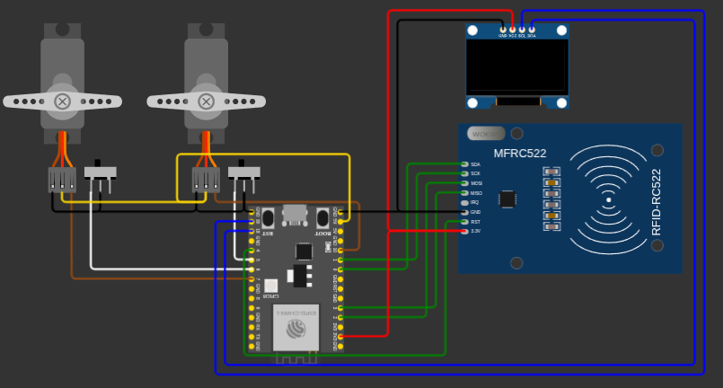

# IoT Device

Sistema IoT para controle e rastreabilidade de acesso a compartimentos
utilizando ESP32-C3, RFID e servomotores.

## Hardware

- ESP32-C3 Super Mini
- RC522 MFRC522
- OLED 128×32 I²C
- 2 servomotores
- 2 switches

## Simulação
O projeto pode ser testado e simulado no Wokwi:

- [RFID](https://wokwi.com/projects/472639873761104897)
- [Display](https://wokwi.com/projects/472546405284788225)
- [Servos](https://wokwi.com/projects/472639525944220673)
- [Chaves](https://wokwi.com/projects/472639231350965249)
- [Wi-Fi](https://wokwi.com/projects/472999404875551745)
- [MQTT](https://wokwi.com/projects/472652823828913153)
- [ALL](https://wokwi.com/projects/472546405284788225)

## Bibliotecas

- ESP32Servo
- U8g2_for_Adafruit_GFX
- Adafruit_SSD1306_72x40
- MFRC522
- PubSubClient

## Diagrama

  

